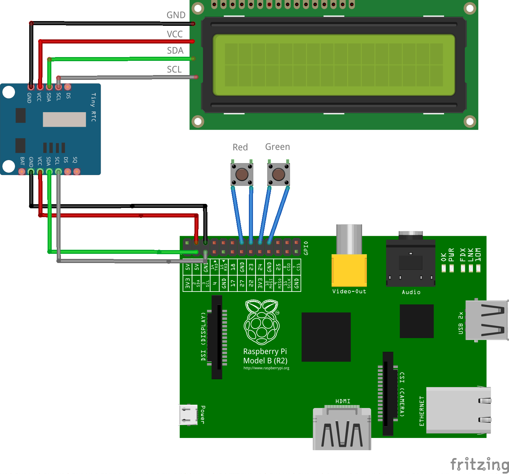

Poll client machine
===================

NodeJS application running on the poll client machine which stands outside the conference rooms.

Hardware
--------
Each machine has 2 push buttons to track polls and an LCD screen display to show the conference to vote to.

Here is the wiring schematic :



**I2C installation**
In order to use the i2c port for the LCD module, you have to do the following on a raspbian :

```
sudo apt-get install i2c-tools
```

Disable blacklist for the modules in `/etc/modprobe.d/raspi-blacklist.conf`:

```
#blacklist spi-bcm2708
#blacklist i2c-bcm2708
```

Activate the i2c driver at boot time in `/etc/modules`:

```
i2c-dev
```

Software
--------
The client is composed of several modules. You can activate the DEBUG mode in order to emulate the hardware through
virtual modules :
```
DEBUG=1 node client.js
```

**The RTC module** 

We use a "RTC Tiny I2C module" based on DS1307, with a rechargeable accu. This one has dual I2C connector so the wire between the Raspberry Pi and the LCD can be splitted and module solded in between.

Can run `sudo i2cdetect -y 1` to confirm I2C bus is well set and connected devices identified.

```
pi@raspberrypi ~ $  sudo i2cdetect -y 1
     0  1  2  3  4  5  6  7  8  9  a  b  c  d  e  f
00:          -- -- -- -- -- -- -- -- -- -- -- -- -- 
10: -- -- -- -- -- -- -- -- -- -- -- -- -- -- -- -- 
20: -- -- -- -- -- -- -- 27 -- -- -- -- -- -- -- -- 
30: -- -- -- -- -- -- -- -- -- -- -- UU -- -- -- -- 
40: -- -- -- -- -- -- -- -- -- -- -- -- -- -- -- -- 
50: 50 -- -- -- -- -- -- -- -- -- -- -- -- -- -- -- 
60: -- -- -- -- -- -- -- -- 68 -- -- -- -- -- -- -- 
70: -- -- -- -- -- -- -- --     
```

"0x27" is the LCD, "0x68" is the RTC clock

Enable the rtc module driver
```
sudo modprobe rtc-ds1307
```

activate the i2c device
```
pi@raspberrypi ~ $ sudo bash
root@raspberrypi:/home/pi# echo ds1307 0x68 > /sys/class/i2c-adapter/i2c-1/new_device
root@raspberrypi:/home/pi# exit
exit
```

Set the Raspberry date. Simplest way is just for the RPI to be connected to the Internet, probably the case as you ssh on the device from our workstation and read this manual. Just confirm by running the `date` command, then write the current date to the RTC device, and read back to confirm:
```
pi@raspberrypi ~ $ sudo hwclock -w
pi@raspberrypi ~ $ sudo hwclock -r
Sat 04 Oct 2014 17:07:09 CEST  -0.995678 seconds
```

Enable RTC on boot, by adding `rtc-ds1307` module to `/etc/modules`, and permanently enable the RTC device using `/etc/rc.local` (just before `exit 0`):
```
echo ds1307 0x68 > /sys/class/i2c-adapter/i2c-1/new_device
sudo hwclock -s
```

TODO dump `hwclock -r` to the LCD on boot before the client software is started, to help confirm the likebox is well set.

**The button module** is used to initialize GPIO pin, to handle push button and emit event when detecting the push
and release. The event `pushed` is emitted when the button is pushed, the event `released` is emitted when the button
is released. A software debounce is in place to avoid repeated fake events. You can also get the state button
(`up` or `down`) at anytime.

The virtual debug module starts an HTTP server defined with the pin button number
(eg: button pin 27 starts an HTTP server on 9027 port).
You can call the following url to emulate the button :

- `/pushed`: the button is pushed
- `/released`: the button is released
- `/click`: the button is pushed the released 500ms after


**The lcd module** is used to print text on the LCD screen. The screen is connected on the i2c bus.

The virtual debug module starts a socket server and print data onto the user console, you can use netcat or telnet
to connect on the socket:

```
nc localhost 9139
```


**The votes module** has the responsibility to store the vote and do the counting.
You can retrieve all vote from a specific timestamp and the count for a specific session.


**The schedule module** read the schedule to extract the list of rooms and the current voting session
with the end vote date.
